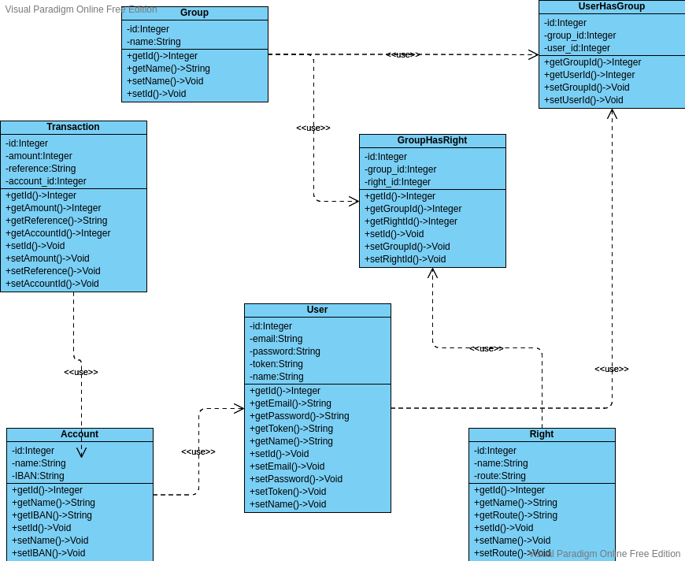
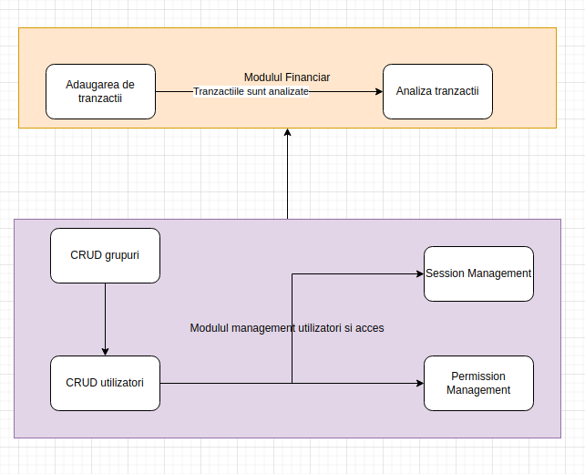

<h1>Finantel</h1>
<h2>UAIC - FEAA - 2021 - SIA11 - 11</h2>
<h3>Management financiar si educatie financiara</h3>
<h4>Scopul proiectului</h4>

Incurajarea urmarii cheltuielilor si a veniturilor pentru o mai buna monitorizare si optimizare

<h4>Diagrama clase</h3>

<h4>Diagrama module</h3>

<h4>Autori/contribuabili/coordonatori:</h3>
<ul>
    <li><b>Coordonator:</b> Conf.univ.dr. Cătălin Strîmbei</li>
    <li><b>Autor 1:</b> Capitanu Teodora</li>
    <li><b>Autor 2:</b> Olaru Amalia Gabriela</li>
    <li><b>Autor 3:</b> Burcovschi David</li>
</ul>
